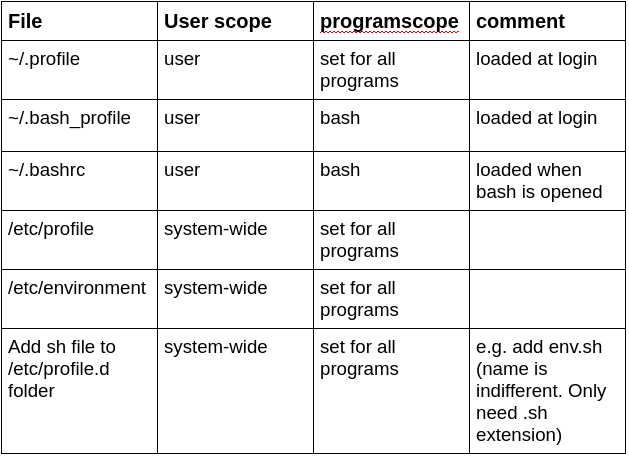

# set path variable

Source: https://stackabuse.com/how-to-permanently-set-path-in-linux/

## decision

variable needed **system wide** : edit  /etc/profile

variable needed **user only**: edit ~/profile

variables **temporary** for terminal session: run ``export PATH="$PATH:<path to new binary>"``

## how to edit
The following procedure is ok for all files in the table,  except for the /etc/enviroment file.

export is not needed necessarily. It just defines the variable for subprocesses as well.

Add Path with:
``` shell
export PATH="$PATH:<path to new binary>:<..another path>"
```

for example:

``` shell
export PATH="$PATH:/home/tomahawk/tools/jdk1.8.0_92/bin"
```

and reload the file with the source command afterwards. For example like this:

```shell
source ~/.profile
```


Exception is /etc/enviroment file which does not get executed. Here you need to add the path manually into the string.


## overview

